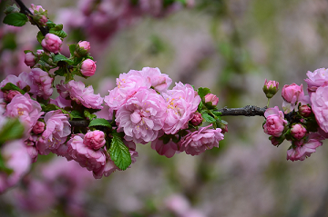
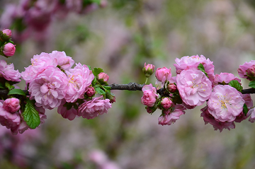
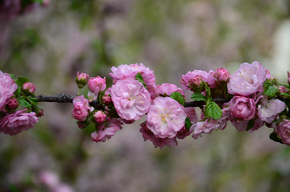
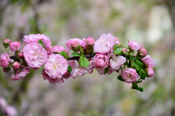
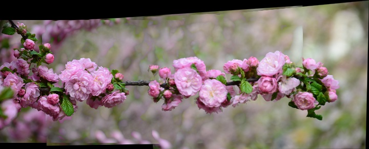

# Image Stitching

## Aim
To implement a efficient method to implement panorama stitching, which  takes any number of images as input(in order), and gives the panorama stitched output.

## Working
1. Detecting keypoints in the image using Harris corner method and using inbuilt opencv function SIFT to identify invariant descriptors in the image
2. Matching the Descriptors in the images so as to stitch them to form panorama using brute force methodology
3. Calculating Homography matrix to shift the image with respective to each other so as to stitch them together
4. Apply a warping transformation to images obtained from the above steps to finally create panorama
5. Finally stitching the 2 images obtained in the same plane by removing overlapping portion between them.

## Input Images

## Output Image

